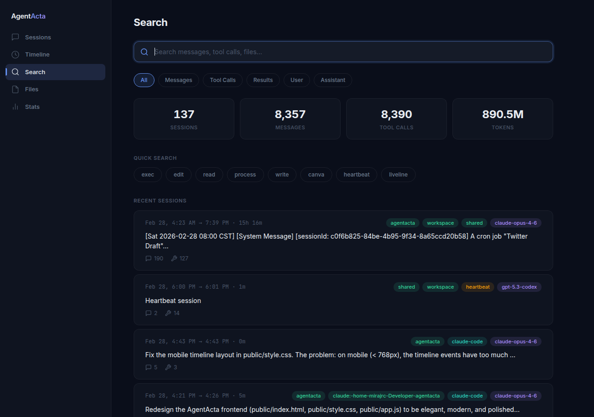
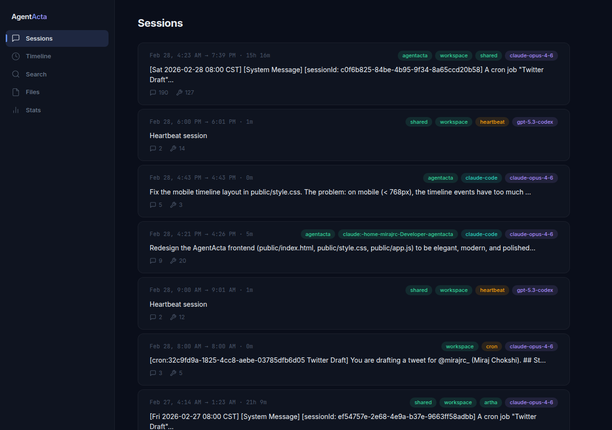
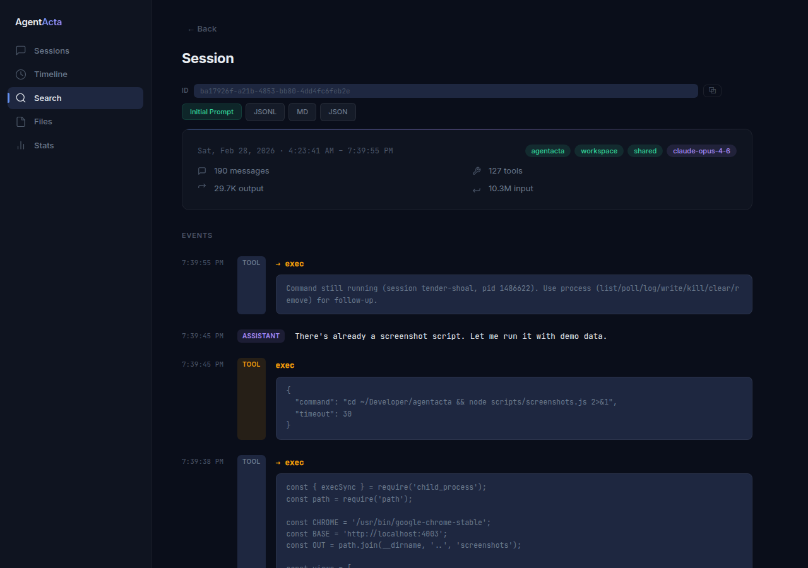
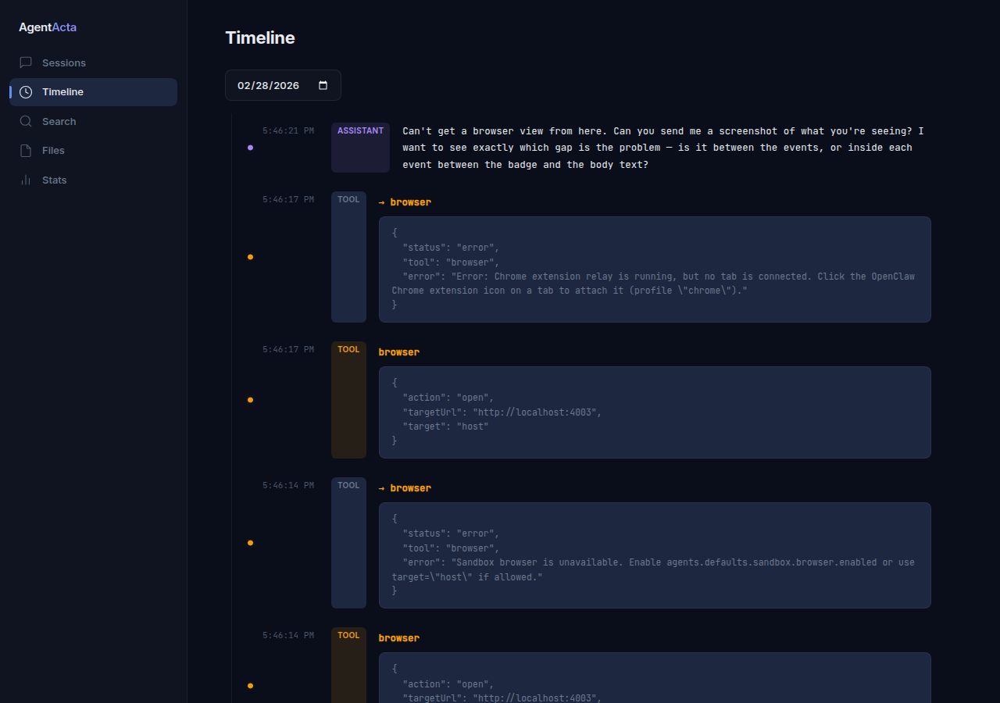
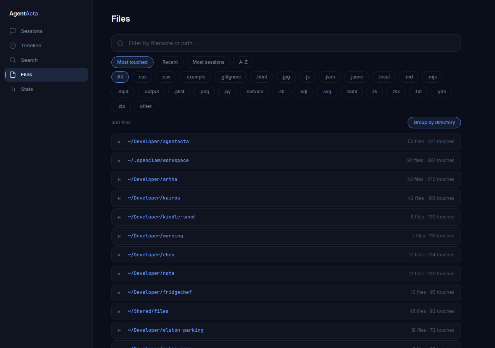
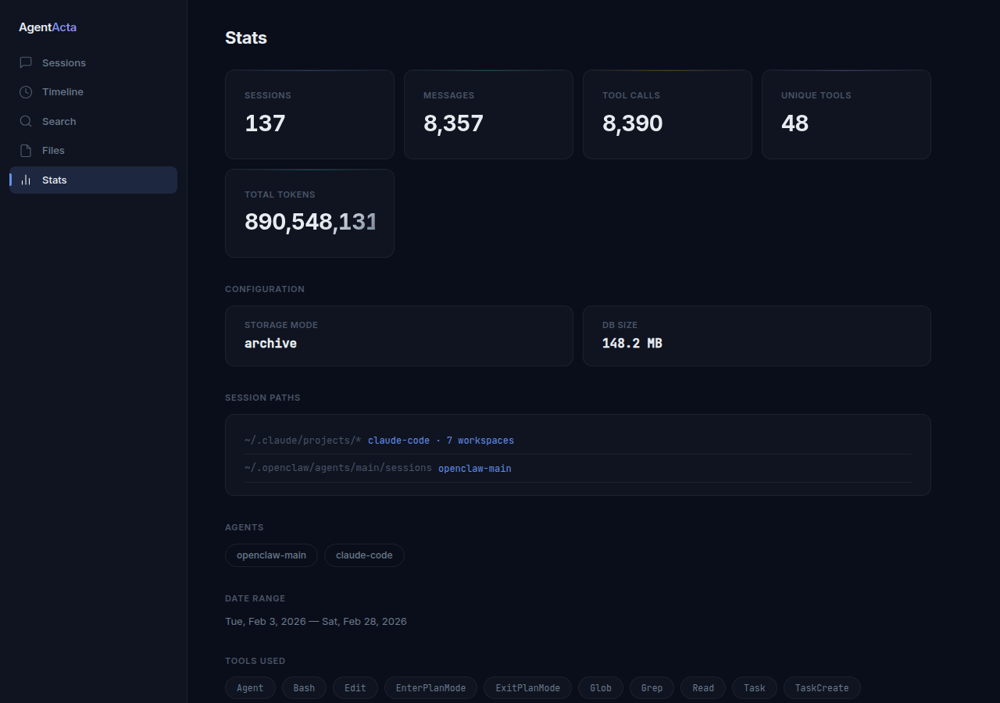
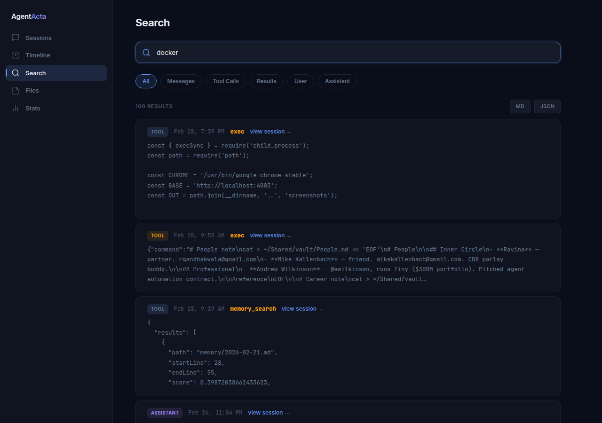

# AgentActa

[](https://github.com/mirajchokshi/agentacta/actions/workflows/ci.yml)
[](https://www.npmjs.com/package/agentacta)
[](LICENSE)

**Your AI agent does hundreds of things. Can you find them?**

AgentActa is an audit trail and search engine for AI agent sessions. It indexes everything your agent did — every message, tool call, file edit, web search, and decision — into a fast, searchable local interface.

One command. Zero config. Full visibility.

```bash
npx agentacta
```

---

## Why

AI agents are powerful. They write code, send emails, manage infrastructure, make decisions on your behalf. But when you need to know *what happened* — what was changed, when, and why — you're digging through scattered logs or asking the agent to remember (it won't).

AgentActa gives you a single, searchable view of everything.

## What You Get

🔍 **Full-text search** across all messages, tool calls, and results
📋 **Session browser** with summaries, token breakdowns (input/output), and model info
📅 **Timeline view** — everything that happened on any given day
📁 **File activity** — every file your agent touched, across all sessions
📊 **Stats** — sessions, messages, tool usage, token counts
⚡ **Live indexing** — new sessions appear automatically via file watching
📱 **Mobile-friendly** — responsive UI with bottom tab navigation
💡 **Smart suggestions** — quick search chips derived from your actual session data

## Demo

https://github.com/mirajchokshi/agentacta/raw/main/screenshots/demo-final.mp4

## Screenshots









## Quick Start

```bash
# Run directly (no install needed)
npx agentacta

# Or install globally
npm install -g agentacta
agentacta
```

Open `http://localhost:4003` in your browser.

AgentActa automatically finds your sessions in:
- `~/.openclaw/agents/*/sessions/` (OpenClaw)
- `~/.claude/projects/*/` (Claude Code)

Or point it at a custom path:

```bash
AGENTACTA_SESSIONS_PATH=/path/to/sessions agentacta
```

## Features

### Search
Full-text search powered by SQLite FTS5. Filter by message type (messages, tool calls, results) and role (user, assistant). Quick search suggestions are generated from your actual data — most-used tools, common topics, frequently touched files.

### Sessions
Browse all indexed sessions with auto-generated summaries, token breakdowns (output vs input), and model info. Sessions are automatically tagged by type — cron jobs, sub-agent tasks, and heartbeat sessions get distinct badges. Click into any session to see the full event history, most recent first.

### Timeline
Pick a date, see everything that happened. Messages, tool invocations, file changes — most recent first.

### File Activity
See every file your agent read, wrote, or edited. Sort by most touched, most recent, or most sessions. Filter by extension, group by directory. Click any file to see which sessions touched it and what was done.

### Export
Download any session or search results as Markdown or JSON. Great for sharing, auditing, or archiving.

## How It Works

AgentActa reads JSONL session files (the standard format used by OpenClaw and Claude Code), parses every message and tool call, and indexes them into a local SQLite database with FTS5 full-text search.

The web UI is a single-page app served by a lightweight Node.js HTTP server. No frameworks, no build step, no external dependencies beyond `better-sqlite3`.

```
Session JSONL files → SQLite + FTS5 index → HTTP API → Web UI
```

Data never leaves your machine.

## Configuration

On first run, AgentActa creates a config file with sensible defaults at `~/.config/agentacta/config.json` (or `agentacta.config.json` in the current directory if it exists):

```json
{
  "port": 4003,
  "storage": "reference",
  "sessionsPath": null,
  "dbPath": "./agentacta.db",
  "projectAliases": {}
}
```

### Storage Modes

- **`reference`** (default) — Lightweight index. Stores parsed events in SQLite but not the raw JSONL. Source files must remain on disk.
- **`archive`** — Full JSONL stored in SQLite. Sessions survive even if the original files are deleted. Uses more disk space.

### Environment Variables

| Variable | Default | Description |
|---|---|---|
| `PORT` | `4003` | Server port |
| `AGENTACTA_HOST` | `127.0.0.1` | Bind address (see [Security](#security)) |
| `AGENTACTA_SESSIONS_PATH` | Auto-detected | Custom sessions directory |
| `AGENTACTA_DB_PATH` | `./agentacta.db` | Database file location |
| `AGENTACTA_STORAGE` | `reference` | Storage mode (`reference` or `archive`) |
| `AGENTACTA_PROJECT_ALIASES_JSON` | unset | JSON object mapping inferred project names (e.g. `{"old-name":"new-name"}`) |

## API

AgentActa exposes a JSON API for programmatic access — useful for integrating search into your agent's workflow.

| Endpoint | Description |
|---|---|
| `GET /api/stats` | Overview: session count, messages, tools, tokens |
| `GET /api/sessions` | List sessions with metadata and token breakdowns |
| `GET /api/sessions/:id` | Full session with all events |
| `GET /api/search?q=<query>` | Full-text search with type/role/date filters |
| `GET /api/suggestions` | Data-driven search suggestions |
| `GET /api/timeline?date=YYYY-MM-DD` | All events for a given day |
| `GET /api/files` | All files touched across sessions |
| `GET /api/export/session/:id?format=md` | Export session as Markdown or JSON |
| `GET /api/export/search?q=<query>&format=md` | Export search results |

### Agent Integration

Your AI agent can query AgentActa for better recall:

```javascript
const results = await fetch('http://localhost:4003/api/search?q=deployment+issue&limit=5');
const data = await results.json();
// Agent now has context from past sessions
```

### Demo Mode

Want to see what AgentActa looks like with data? Run with demo sessions:

```bash
# Generate demo data and start in demo mode
npm run demo

# Or separately:
node scripts/seed-demo.js
node index.js --demo
```

This creates 7 realistic sessions simulating a developer building a weather app — scaffolding, API integration, frontend, debugging, deployment, tests, and a sub-agent task.

## Security

**AgentActa is a local tool.** It binds to `127.0.0.1` by default — only accessible from your machine.

To expose on your network (e.g., for Tailscale access):

```bash
AGENTACTA_HOST=0.0.0.0 agentacta
```

⚠️ **Important:** Agent session data can contain sensitive information — file contents, API responses, personal messages, tool call arguments. If you expose AgentActa on a network, ensure it's a trusted one. There is no built-in authentication.

## Tech Stack

- **Node.js** — HTTP server (built-in `http`, no Express)
- **better-sqlite3** — Fast SQLite with FTS5 full-text search
- **Vanilla HTML/CSS/JS** — No framework, no build step
- **PWA** — Installable as a home screen app

## Privacy

All data stays local. AgentActa runs entirely on your machine — no cloud services, no telemetry, no external requests. Your agent history is yours.

## Compatibility

- ✅ [OpenClaw](https://github.com/openclaw/openclaw)
- ✅ Claude Code
- 🔜 Codex CLI
- 🔜 Custom JSONL formats

## Contributing

PRs welcome! See [CONTRIBUTING.md](CONTRIBUTING.md) for dev setup and guidelines. If you're adding support for a new agent format, add a parser in `indexer.js` and open a PR.

## Etymology

*Acta* (Latin) — "things done." In ancient Rome, the *acta diurna* were daily public records of official proceedings — senate decisions, military victories, births and deaths — posted in public spaces for all citizens to read.

AgentActa is the same idea: a complete, searchable record of everything your AI agent did.

## License

MIT

---

Built in Chicago by humans and agents working together.
