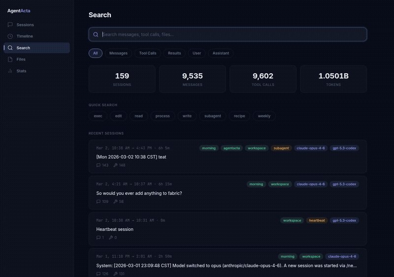

# AgentActa

[](https://github.com/mirajchokshi/agentacta/actions/workflows/ci.yml)
[](https://www.npmjs.com/package/agentacta)
[](LICENSE)

**Your agent did 1000s of things today. Can you find the 1 that broke prod?**

AgentActa is a local audit trail and search engine for AI agent sessions.

It indexes messages, tool calls, file edits, searches, and decisions into a fast UI you can query in seconds.

One command. Zero config. Full visibility.

```bash
npx agentacta
```

<p align="center">
  
</p>

## Why this exists

Agents move fast. Your memory of what happened doesn’t.

When you need to answer “what changed, when, and why,” you’re usually scraping logs, scrolling transcripts, or asking the same assistant that forgot 20 minutes ago.

AgentActa gives you one place to inspect the full trail.

## What you get

- 🔍 Full-text search across messages, tool calls, and results
- 📋 Session browser with summaries, token breakdowns, and model info
- 🧭 Project-scoped session filtering with per-event attribution
- 🤖 Clear Codex run visibility for direct and Symphony-origin sessions
- 📅 Timeline view with live updates for today
- 📁 File activity across all indexed sessions
- 🌗 Light and dark themes
- 📊 Stats for sessions, messages, tools, and tokens
- ⚡ Live indexing via file watching
- 📱 Mobile-friendly UI
- 💡 Search suggestions based on real data
- ⌨️ Command palette (⌘K / Ctrl+K) for quick navigation
- 🎨 Theme settings (system, light, dark, OLED)
- 🏥 Health endpoint for monitoring (`/api/health`)


## Quick start

```bash
# run directly
npx agentacta

# or install globally
npm install -g agentacta
agentacta
```

Open: `http://localhost:4003`

Auto-detected session paths:
- `~/.openclaw/agents/*/sessions/` (OpenClaw)
- `~/.claude/projects/*/` (Claude Code)
- `~/.codex/sessions/` (Codex CLI)

Custom path:

```bash
AGENTACTA_SESSIONS_PATH=/path/to/sessions agentacta
```

## Core features

### Search

SQLite FTS5 full-text search with filters for message type (messages, tool calls, results) and role (user, assistant).

Suggestions come from your own dataset: top tools, common topics, frequently touched files.

### Sessions

Browse indexed sessions with auto-generated summaries, token splits (input/output), and model details. Click into any session to see the full event history.

Session detail view supports project-scoped filtering, so mixed-project sessions can be narrowed down without losing the full underlying transcript. The Initial Prompt jump still resolves from full session context even when a project filter is active.

Session types get tagged so noisy categories are easier to spot (cron, sub-agent, heartbeat). Codex-backed work is also distinguished more clearly, including direct Codex runs and Symphony-origin Codex sessions.

### Timeline

Pick a date, see everything that happened, newest first. Today's view updates live as new events come in.

### File Activity

See what files were touched, how often, and by which sessions.

Sort by recency, frequency, or session count. Filter by extension. Group by directory. Click any file to see which sessions touched it.

### Export

Export sessions or search results as Markdown or JSON.

Useful for handoffs, incident writeups, and audit archives.

## How it works

AgentActa parses JSONL session files (OpenClaw, Claude Code, Codex CLI), then indexes events into local SQLite with FTS5.

The UI is a single-page app served by a lightweight Node HTTP server.

No framework build pipeline. Minimal moving parts.

```text
Session JSONL files -> SQLite + FTS5 index -> HTTP API -> Web UI
```

Everything stays on your machine.

## Configuration

On first run, AgentActa creates:
- `~/.config/agentacta/config.json`
- or `agentacta.config.json` in current directory (if present)

Default config (auto-generated on first run — session directories are detected automatically):

```json
{
  "port": 4003,
  "storage": "reference",
  "sessionsPath": ["~/.claude/projects", "~/.openclaw/sessions"],
  "dbPath": "./agentacta.db",
  "projectAliases": {}
}
```

`sessionsPath` accepts a string, a colon-delimited string, or a JSON array.

### Storage modes

- `reference` (default): index parsed events in SQLite, keep source JSONL on disk. Lightweight.
- `archive`: store full JSONL in SQLite. Sessions survive even if original files are deleted. Uses more disk.

### Environment variables

| Variable | Default | Description |
|---|---|---|
| `PORT` | `4003` | Server port |
| `AGENTACTA_HOST` | `127.0.0.1` | Bind address |
| `AGENTACTA_SESSIONS_PATH` | auto-detected | Custom sessions directory |
| `AGENTACTA_DB_PATH` | `./agentacta.db` | Database path |
| `AGENTACTA_STORAGE` | `reference` | `reference` or `archive` |
| `AGENTACTA_PROJECT_ALIASES_JSON` | unset | Rename inferred project labels |

## API

| Endpoint | Description |
|---|---|
| `GET /api/stats` | Session/message/tool/token totals |
| `GET /api/sessions` | Session list with metadata |
| `GET /api/sessions/:id` | Full session events |
| `GET /api/search?q=<query>` | Full-text search + filters |
| `GET /api/suggestions` | Search suggestions |
| `GET /api/timeline?date=YYYY-MM-DD` | Events for one day |
| `GET /api/files` | Touched-file inventory |
| `GET /api/export/session/:id?format=md` | Export one session |
| `GET /api/timeline/stream?after=<ts>` | SSE stream for live timeline updates |
| `POST /api/maintenance` | VACUUM + WAL checkpoint (returns size before/after) |
| `GET /api/health` | Server status, version, uptime, session count |
| `GET /api/export/search?q=<query>&format=md` | Export search results |

### Context API

The Context API gives agents historical context before they start working. Instead of exploring a codebase from scratch, an agent can query what's happened before.

| Endpoint | Description |
|---|---|
| `GET /api/context/file?path=<filepath>` | History for a specific file |
| `GET /api/context/repo?path=<repo-path>` | Aggregates for a repo/project |
| `GET /api/context/agent?name=<agent-name>` | Stats for a specific agent |

**File context** — how many sessions touched this file, when it was last modified, recent change summaries, operation breakdown (reads vs edits), related files, and recent errors:

```bash
curl http://localhost:4003/api/context/file?path=/home/user/project/server.js
```
```json
{
  "file": "/home/user/project/server.js",
  "sessionCount": 34,
  "lastModified": "3h ago",
  "recentChanges": ["Added OAuth state validation", "Fixed password masking"],
  "operations": { "edit": 105, "read": 56 },
  "relatedFiles": [{ "path": "public/app.js", "count": 28 }],
  "recentErrors": []
}
```

**Agent context** — total sessions, cost, average duration, most-used tools, recent work:

```bash
curl http://localhost:4003/api/context/agent?name=claude-code
```
```json
{
  "agent": "claude-code",
  "sessionCount": 60,
  "totalCost": 18.83,
  "avgDuration": 288,
  "topTools": [{ "tool": "edit", "count": 190 }, { "tool": "exec", "count": 560 }],
  "recentSessions": [{ "id": "...", "summary": "Added context API...", "timestamp": "..." }],
  "successRate": 100
}
```

**Repo context** — aggregate cost, tokens, distinct agents, most-touched files, common tools:

```bash
curl http://localhost:4003/api/context/repo?path=agentacta
```

#### Using the Context API with agents

Inject context into agent prompts so new sessions start informed:

```bash
# Fetch context before starting Claude Code
CONTEXT=$(curl -s http://localhost:4003/api/context/file?path=$(pwd)/server.js)
claude --print "Context from previous sessions: $CONTEXT

Your task: refactor the auth module"
```

Or add it to a CLAUDE.md / AGENTS.md:

```markdown
## Project Context API
Before modifying key files, query AgentActa for history:
curl http://localhost:4003/api/context/file?path={filepath}
```

Agent integration example:

```javascript
const res = await fetch('http://localhost:4003/api/search?q=deployment+issue&limit=5');
const data = await res.json();
```

## Security

AgentActa binds to `127.0.0.1` by default.

If you expose it on a network, do it intentionally:

```bash
AGENTACTA_HOST=0.0.0.0 agentacta
```

**Important:** Session data can contain sensitive content (file snippets, API payloads, personal messages, tool args). There is no built-in auth yet, so only expose on trusted networks.

## Tech stack

- Node.js (built-in `http`)
- `better-sqlite3` + SQLite FTS5
- Vanilla HTML/CSS/JS
- PWA support

## Privacy

No telemetry. No cloud sync. No external indexing service.

Your session history stays local.

## Compatibility

- ✅ [OpenClaw](https://github.com/openclaw/openclaw)
- ✅ Claude Code
- ✅ Codex CLI
- 🔜 Custom JSONL formats

## Contributing

PRs welcome.

See [CONTRIBUTING.md](CONTRIBUTING.md). If you’re adding a new agent format, start in `indexer.js`.

## Name

*Acta* is Latin for “things done.”

That’s the job here: keep a readable record of what your agents actually did.

## License

MIT

---

Built in Chicago by humans and agents.
