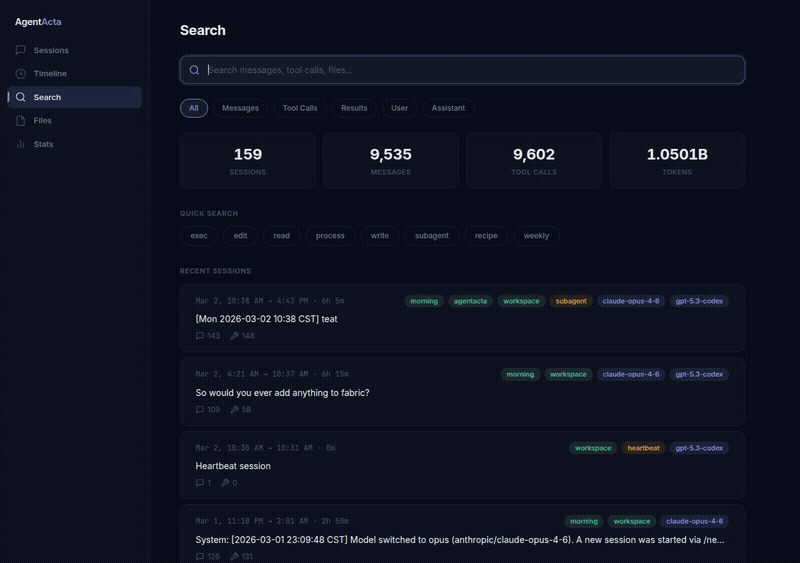

# AgentActa

[](https://github.com/mirajchokshi/agentacta/actions/workflows/ci.yml)
[](https://www.npmjs.com/package/agentacta)
[](LICENSE)

**Your agent did 1000s of things today. Can you find the 1 that broke prod?**

AgentActa is a local audit trail and search engine for AI agent sessions.

It indexes messages, tool calls, file edits, searches, and decisions into a fast UI you can query in seconds.

One command. Zero config. Full visibility.

```bash
npx agentacta
```

<p align="center">
  
</p>

## Why this exists

Agents move fast. Your memory of what happened doesn't.

When you need to answer "what changed, when, and why," you're usually scraping logs, scrolling transcripts, or asking the same assistant that forgot 20 minutes ago.

AgentActa gives you one place to inspect the full trail.

## What you get

- 🔍 Full-text search across messages, tool calls, and results
- 📋 Session browser with summaries, token breakdowns, and model info
- 🧭 Project-scoped session filtering with per-event attribution
- 🤖 Clear Codex run visibility for direct and Symphony-origin sessions
- 📅 Timeline view with live updates for today
- 📁 File activity across all indexed sessions
- 🌗 Light and dark themes
- 📊 Stats for sessions, messages, tools, and tokens
- ⚡ Live indexing via file watching
- 📱 Mobile-optimized UI with floating navigation
- 🏥 Session health scoring - 11 signals (destructive commands, leaked secrets, retry loops, unfinished tasks, token spikes, …) rolled into a reliability score
- 🚨 Proactive digest and alerts - a plain-English "what happened, what needs you" overview with trends, live alert toasts, optional desktop notifications
- 🧵 Task tracing - every session's plan (todo lists, task tools, Codex plans), subagents and turns as a waterfall timeline
- 🤖 Optional Sign in with ChatGPT - written session briefs and daily briefings using your own ChatGPT plan, only when you ask
- 💡 Search suggestions based on real data
- ⌨️ Command palette (⌘K / Ctrl+K) for quick navigation
- 🎨 Theme settings (system, light, dark, OLED)
- 🏥 Health endpoint for monitoring (`/api/health`)


## Quick start

```bash
# run directly
npx agentacta

# or install globally
npm install -g agentacta
agentacta
```

Open: `http://localhost:4003`

Auto-detected session paths:
- `~/.openclaw/agents/*/sessions/` (OpenClaw)
- `~/.claude/projects/*/` (Claude Code)
- `~/.codex/sessions/` (Codex CLI)

Custom path:

```bash
AGENTACTA_SESSIONS_PATH=/path/to/sessions agentacta
```

## Core features

### Search

SQLite FTS5 full-text search with filters for message type (messages, tool calls, results) and role (user, assistant).

Suggestions come from your own dataset: top tools, common topics, frequently touched files.

### Sessions

Browse indexed sessions with auto-generated summaries, token splits (input/output), and model details. Click into any session to see the full event history.

Session detail view supports project-scoped filtering, so mixed-project sessions can be narrowed down without losing the full underlying transcript. The Initial Prompt jump still resolves from full session context even when a project filter is active.

Session types get tagged so noisy categories are easier to spot (cron, sub-agent, heartbeat). Codex-backed work is also distinguished more clearly, including direct Codex runs and Symphony-origin Codex sessions.

### Timeline

Pick a date, see everything that happened, newest first. Today's view updates live as new events come in.

### Insights

The Insights tab surfaces session health across your entire history.

It tracks five issue signals - repeated tool loops, sessions that produced no output, high error rates, vague instructions, and incomplete sessions. Each signal is severity-scaled so scores reflect how bad the problem actually was, not just whether it occurred.

The reliability score (0-100) is the inverse of the confusion score: higher means the agent completed work cleanly. The issue rate shows what percentage of possible signal types were detected in a session.

### File Activity

See what files were touched, how often, and by which sessions.

Sort by recency, frequency, or session count. Filter by extension. Group by directory. Click any file to see which sessions touched it.

### Export

Export sessions or search results as Markdown or JSON.

Useful for handoffs, incident writeups, and audit archives.

## How it works

AgentActa parses JSONL session files (OpenClaw, Claude Code, Codex CLI), then indexes events into local SQLite with FTS5.

The UI is a single-page app served by a lightweight Node HTTP server.

No framework build pipeline. Minimal moving parts.

```text
Session JSONL files -> SQLite + FTS5 index -> HTTP API -> Web UI
```

Everything stays on your machine.

## Configuration

On first run, AgentActa creates:
- `~/.config/agentacta/config.json`
- or `agentacta.config.json` in current directory (if present)

Default config shape (auto-generated on first run - session directories are detected automatically):

```json
{
  "port": 4003,
  "storage": "reference",
  "sessionsPath": null,
  "dbPath": "./agentacta.db",
  "projectAliases": {}
}
```

Leave `sessionsPath` as `null` to use auto-discovery, or set it to add custom session roots.
It accepts a string, a colon-delimited string, or a JSON array.

### Storage modes

- `reference` (default): index parsed events in SQLite, keep source JSONL on disk. Lightweight.
- `archive`: store full JSONL in SQLite. Sessions survive even if original files are deleted. Uses more disk.

### Environment variables

| Variable | Default | Description |
|---|---|---|
| `PORT` | `4003` | Server port |
| `AGENTACTA_HOST` | `127.0.0.1` | Bind address |
| `AGENTACTA_SESSIONS_PATH` | auto-detected | Custom sessions directory |
| `AGENTACTA_DB_PATH` | `./agentacta.db` | Database path |
| `AGENTACTA_STORAGE` | `reference` | `reference` or `archive` |
| `AGENTACTA_PROJECT_ALIASES_JSON` | unset | Rename inferred project labels |
| `AGENTACTA_AI_MODEL` | auto | Model used for AI briefs (defaults to the best `gpt-5*` your plan exposes) |
| `AGENTACTA_CHATGPT_PROFILE` | `<config dir>/chatgpt-profile.json` | Where the ChatGPT tokens are stored (0600) |

## API

| Endpoint | Description |
|---|---|
| `GET /api/stats` | Session/message/tool/token totals |
| `GET /api/sessions` | Session list with metadata |
| `GET /api/sessions/:id` | Full session events |
| `GET /api/sessions/:id/stream?after=<ts>` | SSE stream for live session-detail updates |
| `GET /api/search?q=<query>` | Full-text search + filters |
| `GET /api/suggestions` | Search suggestions |
| `GET /api/timeline?date=YYYY-MM-DD` | Events for one day |
| `GET /api/files` | Touched-file inventory |
| `GET /api/export/session/:id?format=md` | Export one session |
| `GET /api/timeline/stream?after=<ts>` | SSE stream for live timeline updates |
| `POST /api/maintenance` | VACUUM + WAL checkpoint (returns size before/after) |
| `GET /api/health` | Server status, version, uptime, session count |
| `GET /api/insights` | Session health summary - reliability scores, issue counts, top flagged sessions |
| `GET /api/insights/session/:id` | Signals and reliability score for one session |
| `GET /api/sessions/:id/tasks` | Task trace: planned tasks, subagent spans, turns, with durations and tool-call attribution |
| `GET /api/digest?hours=24` | Proactive digest: headline, attention feed, metrics vs the previous period, failing tools, churned files, 14-day series |
| `GET /api/alerts` | Open alerts (`?all=1` includes acknowledged) |
| `POST /api/alerts/ack` | Acknowledge alerts: `{"ids":[1,2]}` or `{"ids":"all"}` |
| `GET /api/alerts/stream` | SSE stream of new alerts as sessions are re-indexed |
| `GET /api/chatgpt/status` | Sign in with ChatGPT connection state |
| `POST /api/chatgpt/signin` | Start a sign-in; returns the URL to open in the browser |
| `POST /api/chatgpt/signout` | Forget the stored ChatGPT profile |
| `GET,POST /api/ai/brief?scope=session&id=<id>` | Read the cached brief / write a new one (`scope=digest&hours=24` for the briefing) |
| `GET /api/export/search?q=<query>&format=md` | Export search results |

### Health signals

Every session is scored on 11 signals. The first two raise a **critical** alert, the next four a **warning**:

| Signal | Fires when |
|---|---|
| `destructive_command` | A shell command deletes data or rewrites history: `rm -rf`, `git push --force`, `git reset --hard`, `DROP TABLE`, `kubectl delete`, `terraform destroy`, … |
| `secret_exposure` | An API key, GitHub/Slack/AWS token, JWT or private key shows up in tool arguments or output |
| `high_error_rate` | More than 30% of tool results are errors (Claude Code `is_error`, Codex non-zero exit codes, or error-shaped text) |
| `tool_retry_loop` | The same call with the same arguments repeats 3+ times in a row |
| `unfinished_tasks` | The agent kept a plan (TodoWrite, TaskCreate, `update_plan`) and left items pending or in progress |
| `token_outlier` | The session used 4× the median tokens for its agent |
| `file_churn` | One file was rewritten six or more times |
| `subagent_storm` | Six or more subagents were spawned |
| `session_bail` | 20+ tool calls without a single write or edit |
| `long_prompt_short_session` | A sub-15-word prompt led to 30+ tool calls |
| `no_completion` | The session ended on a tool call instead of a message |

Alerts are stored once per session and signal, retracted automatically if a live session recovers, and streamed to the UI (and, if you opt in under Settings, to desktop notifications).

### Task tracing

`GET /api/sessions/:id/tasks` rebuilds what the agent *planned* from the tools it called and lines it up against what it *did*:

- **Tasks** from Claude Code `TodoWrite` / `TaskCreate` / `TaskUpdate` and Codex `update_plan`: status transitions, start and completion times, tool calls and errors attributed to the task while it was in progress, files touched.
- **Subagents** from `Agent` / `Task` spawns, linked to their own indexed transcript (`<session>/subagents/agent-*.jsonl`) so you get their duration and tool counts.
- **Turns** (user prompts) with tool-call and error counts.

The session page renders this as a waterfall; click any row to jump to the event.

### Sign in with ChatGPT (optional)

AgentActa works fully offline. If you want written briefs, open **Settings → Sign in with ChatGPT**. It uses [OpenAI's flow for open-source local apps](https://developers.openai.com/siwc): a PKCE authorization in your browser with a loopback callback on this machine, dynamic client registration (no API key, no client secret), ID-token verification against OpenAI's JWKS, and tokens stored with owner-only permissions next to your config. Requires a ChatGPT Plus or Pro plan for plan-funded requests.

Once connected, **Write brief** on a session page sends a compact, structured digest of that session (requests, plan, tools, error samples, signals) to the Responses API and returns what was asked, what happened, risks and follow-ups. The Overview's **AI briefing** does the same for the digest window. Nothing is sent until you click, and briefs are cached until the underlying data changes.

### Context API

The Context API gives agents historical context before they start working. Instead of exploring a codebase from scratch, an agent can query what's happened before.

| Endpoint | Description |
|---|---|
| `GET /api/context/file?path=<filepath>` | History for a specific file |
| `GET /api/context/repo?path=<repo-path>` | Aggregates for a repo/project |
| `GET /api/context/agent?name=<agent-name>` | Stats for a specific agent |

**File context** - how many sessions touched this file, when it was last modified, recent change summaries, operation breakdown (reads vs edits), related files, and recent errors:

```bash
curl http://localhost:4003/api/context/file?path=/home/user/project/server.js
```
```json
{
  "file": "/home/user/project/server.js",
  "sessionCount": 34,
  "lastModified": "3h ago",
  "recentChanges": ["Added OAuth state validation", "Fixed password masking"],
  "operations": { "edit": 105, "read": 56 },
  "relatedFiles": [{ "path": "public/app.js", "count": 28 }],
  "recentErrors": []
}
```

**Agent context** - total sessions, cost, average duration, most-used tools, recent work:

```bash
curl http://localhost:4003/api/context/agent?name=claude-code
```
```json
{
  "agent": "claude-code",
  "sessionCount": 60,
  "totalCost": 18.83,
  "avgDuration": 288,
  "topTools": [{ "tool": "edit", "count": 190 }, { "tool": "exec", "count": 560 }],
  "recentSessions": [{ "id": "...", "summary": "Added context API...", "timestamp": "..." }],
  "successRate": 100
}
```

**Repo context** - aggregate cost, tokens, distinct agents, most-touched files, common tools:

```bash
curl http://localhost:4003/api/context/repo?path=agentacta
```

#### Using the Context API with agents

Inject context into agent prompts so new sessions start informed:

```bash
# Fetch context before starting Claude Code
CONTEXT=$(curl -s http://localhost:4003/api/context/file?path=$(pwd)/server.js)
claude --print "Context from previous sessions: $CONTEXT

Your task: refactor the auth module"
```

Or add it to a CLAUDE.md / AGENTS.md:

```markdown
## Project Context API
Before modifying key files, query AgentActa for history:
curl http://localhost:4003/api/context/file?path={filepath}
```

Agent integration example:

```javascript
const res = await fetch('http://localhost:4003/api/search?q=deployment+issue&limit=5');
const data = await res.json();
```

## Security

AgentActa binds to `127.0.0.1` by default.

If you expose it on a network, protect it with a shared token:

```bash
AGENTACTA_HOST=0.0.0.0 AGENTACTA_AUTH_TOKEN="$(openssl rand -hex 24)" agentacta
```

Then open AgentActa once with the token in the URL. AgentActa will store it in a local cookie for the browser:

```text
http://your-host:4003/?token=your-token
```

API clients can send either `Authorization: Bearer your-token` or `X-AgentActa-Token: your-token`.

AgentActa refuses non-loopback binds without `AGENTACTA_AUTH_TOKEN` unless you explicitly set `AGENTACTA_ALLOW_UNAUTHENTICATED_NETWORK=1` for a trusted-network-only deployment.

**Important:** Session data can contain sensitive content (file snippets, API payloads, personal messages, tool args). Do not expose AgentActa publicly without a real access layer in front of it.

## Tech stack

- Node.js (built-in `http`)
- `better-sqlite3` + SQLite FTS5
- Vanilla HTML/CSS/JS
- PWA support

## Privacy

No telemetry. No cloud sync. No external indexing service.

Your session history stays local.

## Compatibility

- ✅ [OpenClaw](https://github.com/openclaw/openclaw)
- ✅ Claude Code
- ✅ Codex CLI
- 🔜 Custom JSONL formats

## Contributing

PRs welcome.

See [CONTRIBUTING.md](CONTRIBUTING.md). If you're adding a new agent format, start in `src/indexer.ts`.

## Name

*Acta* is Latin for "things done."

That's the job here: keep a readable record of what your agents actually did.

## License

MIT

---

Built in Chicago by humans and agents.
